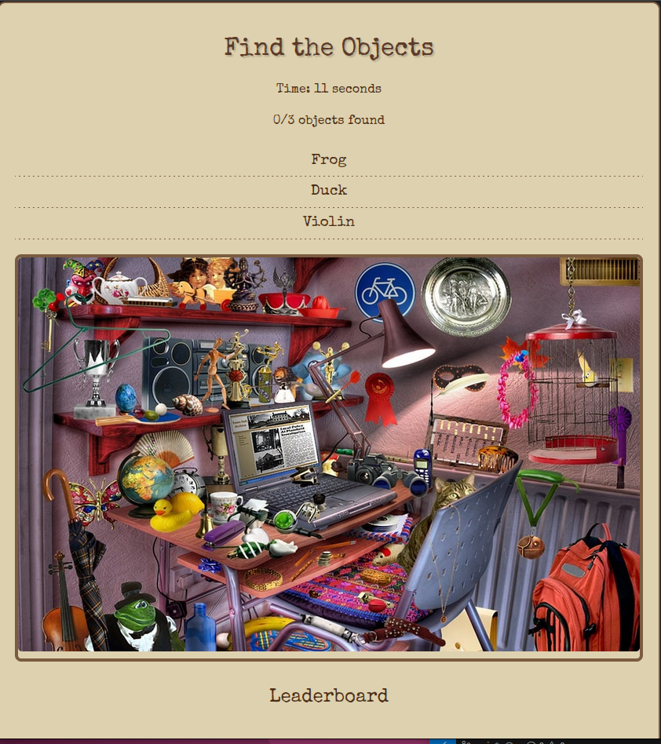

# **README.md for Hidden Object Game**  
> **A React + Ruby on Rails game where players find hidden objects in an image.**

---

## Screenshots

*A rustic-themed hidden object game UI.*

---

##  Features
✅ **Find Hidden Objects** – Click on the image to select objects.  
✅ **Real-Time Feedback** – Get instant confirmation if your selection is correct.  
✅ **Leaderboard** – Tracks fastest players.  
✅ **Rustic UI Design** – Styled with a vintage aesthetic.  
✅ **Backend Validation** – Ensures fair gameplay.  
✅ **Fully Tested Backend** – RSpec tests ensure robustness.  

---

## Tech Stack
- **Frontend:** React + Vite  
- **Backend:** Ruby on Rails  
- **Database:** PostgreSQL  
- **Styling:** Custom CSS  
- **Testing:** RSpec  

---

## Installation
### Clone the Repository
```sh
git clone https://github.com/yourusername/hidden-object-game.git
cd hidden-object-game
```

###  Install Dependencies
#### **Backend (Rails)**
```sh
cd hidden-object-backend
bundle install
rails db:create
rails db:migrate
rails db:seed
rails s
```

#### **Frontend (React + Vite)**
```sh
cd hidden-object-game
npm install
npm run dev
```

---

## *How to Play*
1️⃣ Click anywhere on the image.  
2️⃣ Select the correct object from the dropdown.  
3️⃣ If correct, the object is marked as **found**.  
4️⃣ Find all objects **as fast as possible** to make the leaderboard!  


---

## API Endpoints
| Method | Endpoint | Description |
|--------|----------|-------------|
| `GET`  | `/scores` | Fetch leaderboard data |
| `POST` | `/validate_click` | Check if a selection is correct |
| `POST` | `/scores` | Submit a new high score |

---

## Running Tests
### RSpec Tests
The backend is fully tested using **RSpec**.  

###  Run All Tests
```sh
rspec
```

### Example Test Output
```
GameObject
  is valid with a name and coordinates
  is invalid without a name
  is invalid without coordinates

Objects API
  POST /validate_click returns success if object is found at correct coordinates
  POST /validate_click returns failure if object is at wrong coordinates
  POST /validate_click returns failure if object does not exist

Scores API
  GET /scores returns a list of scores
  POST /scores creates a new score

Finished in 0.3 seconds (files took 1.2 seconds to load)
7 examples, 0 failures
```

###  Running a Specific Test
To run only **object validation tests**:
```sh
rspec spec/models/game_object_spec.rb
```


## **🔗 Live Demo**
[👉 Play the Game](https://whimsical-twilight-ad6dc1.netlify.app/)  
